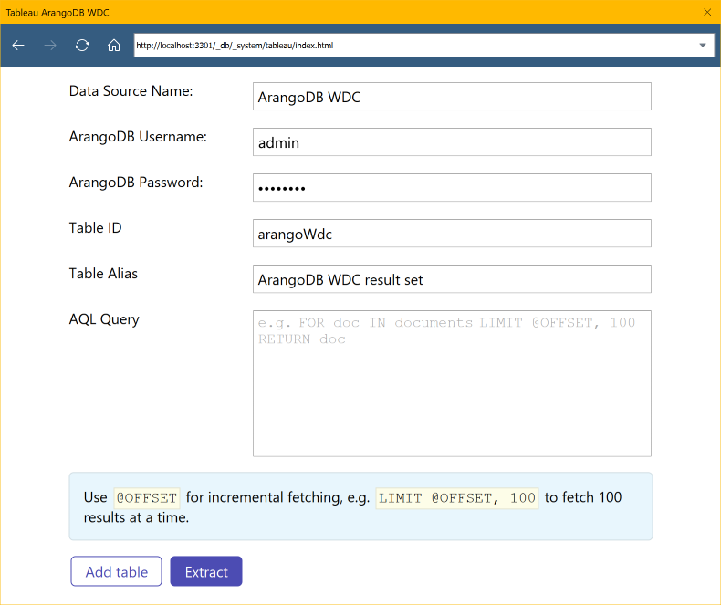

# Tableau Web Data Connector for ArangoDB

This is an example Tableau connector for ArangoDB.



## Features

- Install directly in ArangoDB

- Extract data from AQL queries into Tableau

- Incremental fetching with `@OFFSET`

- Automatic schema inference

- Multi-table (i.e multi-query) support

## Installation

The connector can be installed as a Foxx service using the
[ArangoDB web interface](https://docs.arangodb.com/latest/Manual/Programs/WebInterface/Services.html)
or the [Foxx CLI](https://github.com/arangodb/foxx-cli):

```sh
$ npm install --global foxx-cli
$ foxx install -u root -P -H http://localhost:8529 -D _system /tableau \
https://github.com/arangodb/tableau-arangodb-wdc/archive/master.zip

# or without installing foxx-cli:

$ npx foxx-cli install -u root -P -H http://localhost:8529 -D _system /tableau \
https://github.com/arangodb/tableau-arangodb-wdc/archive/master.zip
```

## Adding the data source

To add the connector as a data source in Tableau Desktop, use the
_New Data Source_ command and find
_Connect > To a Server > Web Data Connector_ or type `web` into the search box
and select _Web Data Connector_.

In the Web Data Connector browser enter the URL of the service running on your
ArangoDB instance (e.g. `http://localhost:8529/_db/_system/tableau`) and fill
in the required information, then press the _Extract_ button to connect
the data source.

- **Data Source Name**: Name of the data source as it will appear in Tableau.

- **ArangoDB Username and Password**: Credentials that will be used to execute
  the queries in ArangoDB. The queries will always be executed on the same
  database the service was installed.

Every query result set is represented in Tableau as a _table_. You can add
additional queries by pressing the _Add table_ button.

- **Table ID**: Identifier that will be used to uniquely identify this table
  in Tableau.

- **Table Alias**: Human-readable description of this table in Tableau.

- **AQL Query**: Query that will be executed to fetch data for this table.

The connector supports three types of query results:

- an object mapping field names to scalar values, in this case the field names
  will be used as column names

- an array of scalar values, in this case column names will be generated

- any scalar value, in this case the value will be treated as a single column

**Note**: The connector will always add an additional incrementing `int` column
with the ID `_i` for technical reasons.

If you want to support incremental fetching you can use a
[LIMIT statement](https://docs.arangodb.com/latest/AQL/Operations/Limit.html)
with an offset of `@OFFSET`, e.g. `LIMIT @OFFSET, 100` to fetch data at
increments of 100 results at a time.

## License

This code is licensed under the
[Apache License, Version 2.0](https://www.apache.org/licenses/LICENSE-2.0).
